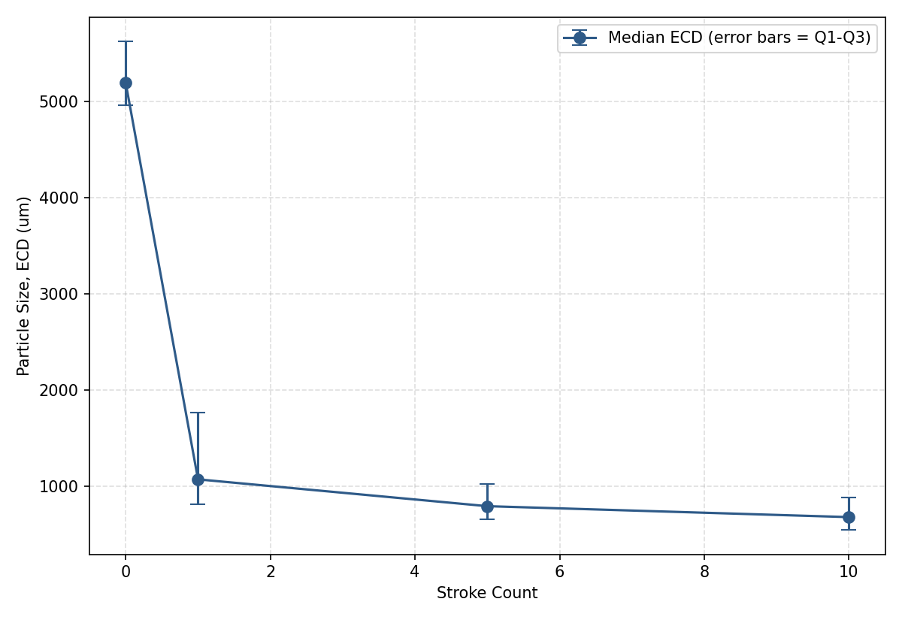

# Gelfoam Particle Size vs. Stroke Count — Microscope Measurement Dataset

## Purpose
Characterizes how Gelfoam-surrogate particle size (equivalent circular
diameter, ECD) changes with syringe mixing stroke count. This dataset forms
the imaging/ground-truth half of the UAS voltage &harr; particle size
calibration effort (see `uas_cv_calibration.py` in the CV pipeline).

## Method
- **Instrument:** HIROX KH-8700 3D digital microscope, built-in 2D
  measurement tool (Area/auto-width), calibrated per-zoom.
- **Sizing metric:** Equivalent Circular Diameter (ECD), computed as
  `ECD = 2 x sqrt(Area / pi)` from each particle's measured area — the
  standard convention for irregular-particle sizing, consistent with
  clinical embolic agent size classifications.
- **Sample prep:** batch mixed on syringe to target stroke count, aliquot
  spread thin in petri dish (dark background, oblique lighting) to separate
  particles for individual measurement.
- **Exclusions applied consistently across all samples:** particles cut off
  at frame edges, and particles with boundaries too indistinct to
  confidently outline, were excluded — see per-sample n counts below.

## Results summary

| Stroke Count | n particles | Median ECD (um) | IQR (um) | Min (um) | Max (um) |
|---|---|---|---|---|---|
| 0  | 5   | 5194.9 | 667.0 | 4869.8 | 5920.4 |
| 1  | 152 | 1072.8 | 951.3 | 357.5  | 3719.3 |
| 5  | 151 | 794.2  | 363.7 | 416.3  | 2865.2 |
| 10 | 414 | 680.5  | 335.0 | 268.4  | 2267.1 |

Full statistics (mean, stdev, Q1, Q3) in `summary_all_strokes.csv`.



**Trend:** median particle size drops sharply between 0 and 1 stroke, then
continues decreasing with diminishing returns through stroke 10 — consistent
with expected mechanical fragmentation behavior (large initial size
reduction, flattening as material is progressively broken down further).
IQR also narrows with increasing stroke count, indicating mixing improves
size *consistency* in addition to reducing median size.

**Note on stroke 0:** n=5 is a much smaller sample than the other conditions
(expected, since this is essentially unmixed material) — treat as an
approximate anchor point rather than as statistically robust as strokes
1/5/10.

## Repository structure
```
stroke0/    raw microscope images + measurement CSVs, 0 strokes
stroke1/    raw microscope images + measurement CSVs, 1 stroke
stroke5/    raw microscope images + measurement CSVs, 5 strokes
stroke10/   raw microscope images + measurement CSVs, 10 strokes

particle_measurements_stroke0.csv    per-particle ECD (um), sample_id=stroke0
particle_measurements_stroke1.csv    per-particle ECD (um), sample_id=stroke1
particle_measurements_stroke5.csv    per-particle ECD (um), sample_id=stroke5
particle_measurements_stroke10.csv   per-particle ECD (um), sample_id=stroke10

summary_all_strokes.csv              one row per stroke count: n, median,
                                      Q1, Q3, IQR, mean, stdev, min, max
median_vs_stroke_count.png           trend graph (median +/- IQR vs stroke count)
```

## Next steps
- Extend stroke sweep to additional counts (15, 20, up to 40) to fill in
  the trend curve.
- Pair each stroke count's median/IQR with a matching UAS voltage reading
  (same batch, same-moment split) to build the full voltage-to-size
  calibration dataset — see `uas_cv_calibration.py`.
